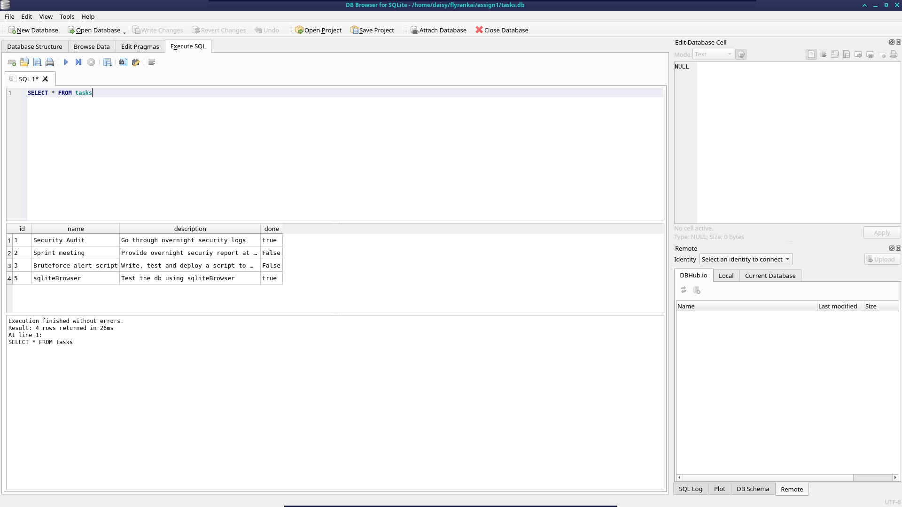

# Task Manager REST API

A simple REST API built with **Node.js**, **Express.js**, and **SQLite** for managing tasks. The API supports the basic CRUD (Create, Read, Update, Delete) operations and stores task data in a local SQLite database for persistence.

---

## Features

- View API information
- Health check endpoint
- List all tasks
- Retrieve a task by ID
- Create a new task
- Update an existing task
- Delete a task
- Interactive API documentation using Swagger UI
- Persistent data storage using SQLite

---

## Technologies Used

- Node.js
- Express.js
- SQLite
- Node.js built-in `node:sqlite` module
- Swagger UI Express
- Swagger JSDoc

---

## Why SQLite?

SQLite was chosen because it is:

- Lightweight and requires no separate database server.
- Easy to set up for learning and small projects.
- Stores the entire database in a single file.
- Fast enough for local development and testing.
- A good introduction to relational databases and SQL.

---

## Database Location

The SQLite database file is stored in the project root directory as:

```text
tasks.db
```

The database is automatically created the first time the application runs if it does not already exist.

---

## Installation

1. Clone the repository.

```bash
git clone <repository-url>
cd <repository-folder>
```

2. Install dependencies.

```bash
npm install
```

3. Ensure you are using **Node.js 24.x or later**, since this project uses the built-in `node:sqlite` module.

Check your version:

```bash
node -v
```

---

## Running the Project

Start the server using:

```bash
node task_manager.js
```

If successful, the API will be available at:

```text
http://localhost:8080
```

---

## API Documentation

Swagger UI provides interactive documentation for testing the API directly from your browser.

Open:

```text
http://localhost:8080/api-docs
```

---

## API Endpoints

| Method | Endpoint | Description |
|--------|----------|-------------|
| GET | `/` | API information |
| GET | `/health` | Health check |
| GET | `/tasks` | Retrieve all tasks |
| GET | `/tasks/:id` | Retrieve a task by ID |
| POST | `/tasks` | Create a new task |
| PUT | `/tasks/:id` | Update an existing task |
| DELETE | `/tasks/:id` | Delete a task |

---

## Example Task Object

```json
{
  "id": 1,
  "name": "Security Audit",
  "description": "Go through overnight security logs",
  "done": "False"
}
```

---

## Example Request

Create a task:

```http
POST /tasks
Content-Type: application/json
```

```json
{
  "name": "Finish assignment",
  "description": "Complete the REST API project",
  "done": "False"
}
```

Example response:

```json
{
  "id": 4,
  "name": "Finish assignment",
  "description": "Complete the REST API project",
  "done": "False"
}
```

---

## Example SQL Query

The following SQL query was used to retrieve all tasks ordered by their ID:

```sql
SELECT * FROM tasks ORDER BY id;
```

---

## Database Screenshot

Below is a screenshot of the SQLite database viewed using a database viewer.




---

## Response Codes

| Status Code | Meaning |
|-------------|---------|
| 200 | Request completed successfully |
| 201 | Resource created successfully |
| 204 | Resource deleted successfully |
| 400 | Bad request |
| 404 | Resource not found |
| 500 | Internal server error |

---

## Project Structure

```text
.
├── task_manager.js
├── tasks.db
├── database_screenshot.png
├── package.json
├── package-lock.json
└── README.md
```

> Replace `database_screenshot.png` with the actual screenshot filename if different.

---

## Notes

- The application automatically creates the SQLite database if it does not exist.
- Initial sample tasks are inserted only when the database is empty.
- Swagger UI is available for testing all API endpoints.
- This project was created for learning REST API development using Express.js and SQLite.

---

## Future Improvements

- Input validation
- User authentication and authorization
- Pagination and filtering
- Unit and integration tests
- Docker support
- Environment variable configuration

---

## Author

Developed as a learning project demonstrating REST API development using **Node.js**, **Express.js**, **SQLite**, and **Swagger UI**.
